# Diagramme de Classes — Module smi_management

```mermaid
classDiagram
    %% ══════════════════════════════════════════════
    %% MODÈLES ODOO NATIFS (hérités / référencés)
    %% ══════════════════════════════════════════════

    class hr_department {
        <<Odoo native>>
        +id : Integer
        +name : Char
        +parent_id : Many2one
        +scaek_level : Selection [pdg|direction|departement|service|section|equipe]
        +scaek_code : Char
    }

    class hr_employee {
        <<Odoo native>>
        +id : Integer
        +name : Char
        +department_id : Many2one
        +user_id : Many2one
    }

    class hr_job {
        <<Odoo native>>
        +id : Integer
        +name : Char
        +is_linked_to_pdg : Boolean
    }

    class res_users {
        <<Odoo native>>
        +id : Integer
        +name : Char
        +partner_id : Many2one
    }

    %% ══════════════════════════════════════════════
    %% MODÈLES MÉTIER PERMANENTS
    %% ══════════════════════════════════════════════

    class NcType {
        <<smi_management.nc_type>>
        +name : Char [required]
        +code : Char [required, unique]
        +category : Selection [type_nc_produit|type_reclamation|type_sst|type_environnement|type_audit|type_achat|type_reception|type_dysfonctionnement|type_travaux|type_autre]
    }

    class Nonconformity {
        <<smi_management.nonconformity>>
        +name : Char [N° FNC, default=New]
        +date : Date
        +service_dpt : Char
        +sce_dpt_computed : Char [computed]
        -- Types de NC (Boolean) --
        +type_nc_produit : Boolean
        +type_reclamation : Boolean
        +type_sst : Boolean
        +type_environnement : Boolean
        +type_travaux : Boolean
        +type_audit : Boolean
        +type_audit_interne : Boolean
        +type_audit_externe : Boolean
        +type_achat : Boolean
        +type_reception : Boolean
        +type_dysfonctionnement : Boolean
        +type_autre : Boolean
        +type_autre_preciser : Char
        -- Section 1 —  Description --
        +description : Text
        +date_signalement : Date
        +fonction_visa : Char
        -- Traitement --
        +trait_reprise : Boolean
        +trait_declassement : Boolean
        +trait_retour_fourn : Boolean
        +trait_recyclage : Boolean
        +trait_reparation : Boolean
        +trait_autre : Boolean
        +trait_autre_preciser : Char
        -- Section 2 — Action immédiate --
        +action_immediate : Text
        +date_realisation : Date
        -- Section 3 — Analyse --
        +analyse_causes : Text
        +impact : Text
        -- Validation --
        +date_validation : Date
        +signature : Char
        -- Computed --
        +fac_number_display : Char [computed]
        +can_access_fac : Boolean [computed]
        -- Statut --
        +state : Selection [draft|submitted|in_progress|validated]
    }

    class CorrectiveAction {
        <<smi_management.corrective_action>>
        +name : Char [N° FAC, readonly]
        +date : Date
        -- Section 1 —  Rappel NC --
        +rappel_nc : Text
        -- Section 2 — Analyse des causes --
        +analyse_causes : Text
        +date_analyse : Date
        +visa_analyse : Char
        -- Section 3 — Actions décidées --
        +date_actions : Date
        +visa_actions : Char
        -- Efficacité --
        +actions_efficaces : Selection [oui|non]
        -- Section 4 — QSE --
        +qse_date : Date
        +qse_visa : Char
        -- Section 5 — Vérification --
        +verification_efficacite : Text
        +extension_possible : Selection [non|oui]
        -- Clôture --
        +date_cloture : Date
        +visa_cloture : Char
        -- FAC dates --
        +date_fnc : Date
        -- Statut --
        +state : Selection [draft|submitted|in_progress|validated|closed]
    }

    class ActionLine {
        <<smi_management.action_line>>
        +action_description : Char
        +date_prevue : Date
        +date_realisation : Date
    }

    class PlanActionSmi {
        <<smi_management.plan_action_smi>>
        +name : Char [Référence, default=New]
        +nature : Selection [nc_produit|reclamation_pi|environnement|sst|audit_externe|audit_interne|swot|risque|objectif_non_atteint|decision_revue_direction|amelioration|nc_reglementaire]
        +description : Text
        +causes : Text
        +action : Text
        +moyens : Char
        +duree_estimee : Char
        +date_prevue : Date
        +date_lancement : Date
        +date_realisation : Date
        +avancement : Integer [%]
        +duree_reelle : Char
        +critere_efficacite : Text
        +efficacite : Selection [oui|non]
        +remarque : Text
        -- Cycle de vie --
        +state : Selection [draft|done]
        +submission_state : Selection [brouillon|soumis|integre|cloture]
        +sent_to_rmqse : Boolean
        +date_envoi : Datetime
        -- Plan global --
        +is_global : Boolean
        +mois_reception : Date
        +date_maj : Datetime [readonly]
        -- Statistiques (computed) --
        +nb_plans_integres : Integer
        +avancement_global : Integer
        +nb_realises : Integer
        +nb_en_cours : Integer
        +nb_en_retard : Integer
        +taux_realisation : Integer
        +taux_efficacite : Integer
        +etat_global : Selection [brouillon|en_cours|cloture]
        +is_late : Boolean
        +is_integrated : Char
        +analyse_html : Html
    }

    class DocumentRevision {
        <<smi_management.document_revision>>
        +name : Char [computed: FNC/FAC - Rev XX]
        +doc_type : Selection [fnc|fac]
        +revision_number : Integer [required]
        +revision_date : Date [required]
        +reference : Char
        +description : Text
        +etat : Selection [valable|obsolete]
        +revision_number_link : Html [computed]
    }

    class FormTemplate {
        <<smi_management.form_template>>
        +name : Char [required]
        +doc_type : Selection [fnc|fac]
        +is_active : Boolean
        +section_count : Integer [computed]
    }

    class FormSection {
        <<smi_management.form_section>>
        +name : Char [required]
        +sequence : Integer
        +is_active : Boolean
        +show_title : Boolean
        +section_layout : Selection [standard|checkboxes_2col|action_lines]
        +line_count : Integer [computed]
    }

    class FormLine {
        <<smi_management.form_line>>
        +sequence : Integer
        +is_active : Boolean
        +line_type : Selection [textarea|row|checkbox|custom_text|separator]
        -- textarea --
        +ta_field : Selection
        +ta_label : Char
        +ta_height : Selection [sm|md|lg|xl]
        -- row (3 cols) --
        +col1_field : Selection
        +col1_label : Char
        +col2_field : Selection
        +col2_label : Char
        +col3_field : Selection
        +col3_label : Char
        -- checkbox --
        +cb_field : Selection
        +cb_label : Char
        +cb_column : Selection [left|right]
        +cb_extra_field : Selection
        +cb_extra_label : Char
        -- texte fixe --
        +custom_text : Char
        -- render types (computed) --
        +render_type_ta : Char
        +render_type_col1 : Char
        +render_type_col2 : Char
        +render_type_col3 : Char
        +render_type_cb : Char
        +nb_cols : Integer
    }

    class NcDashboard {
        <<smi_management.dashboard>>
        +get_stats(period) Dict
        +get_plan_smi_stats() Dict
        +get_efficacite_categorie(field_name) Dict
        +get_direction_details(direction_id, period) Dict
        +get_sender_info(model, record_id) Dict
    }

    %% ══════════════════════════════════════════════
    %% WIZARDS (TransientModel)
    %% ══════════════════════════════════════════════

    class NumberGeneratorWizard {
        <<TransientModel: smi_management.number_generator_wizard>>
        +category : Selection
        +action_confirm()
    }

    class SendFncWizard {
        <<TransientModel: smi_management.send_fnc_wizard>>
        +note : Text
        +action_send()
    }

    class ReplyWizard {
        <<TransientModel: smi_management.reply_wizard>>
        +record_model : Char
        +record_id : Integer
        +note : Text
        +action_reply()
    }

    class NewRevisionWizard {
        <<TransientModel: smi_management.new_revision_wizard>>
        +revision_number : Integer
        +revision_date : Date
        +reference : Char
        +description_changes : Text
        +action_confirm()
    }

    class PlanNumberWizard {
        <<TransientModel: smi_management.plan_number_wizard>>
        +reference : Char
        +action_confirm()
    }

    class ConsolidateWizard {
        <<TransientModel: smi_management.consolidate_wizard>>
        +action_consolidate()
    }

    class ExportPlanWizard {
        <<TransientModel: smi_management.export_plan_wizard>>
        +excel_file : Binary
        +file_name : Char
        +action_export()
    }

    class ExportSmiAnalysisWizard {
        <<TransientModel: smi_management.export_smi_analysis_wizard>>
        +excel_file : Binary
        +file_name : Char
        +action_export()
    }

    class PlanEfficaciteWizard {
        <<TransientModel: smi_management.plan_efficacite_wizard>>
        +chart_html : Html [computed]
    }

    class PlanEfficaciteLine {
        <<TransientModel: smi_management.plan_efficacite_line>>
        +categorie : Char
        +total : Integer
        +efficace : Integer
        +non_efficace : Integer
        +realise_100 : Integer
        +realise_50plus : Integer
        +realise_50moins : Integer
        +taux : Float
    }

    %% ══════════════════════════════════════════════
    %% RELATIONS — MODÈLES MÉTIER
    %% ══════════════════════════════════════════════

    %% hr extensions
    hr_department <|-- hr_department : parent_id (hiérarchie)

    %% FNC → Départements/Employés
    Nonconformity "1" --> "0..1" hr_department : direction_id
    Nonconformity "1" --> "0..1" hr_department : department_id
    Nonconformity "1" --> "0..1" hr_department : service_id
    Nonconformity "1" --> "0..1" hr_department : section_id
    Nonconformity "1" --> "0..1" hr_department : equipe_id
    Nonconformity "1" --> "0..1" hr_employee : signale_par_id
    Nonconformity "1" --> "0..1" hr_employee : realise_par_id
    Nonconformity "1" --> "0..1" hr_employee : responsable_action_id
    Nonconformity "1" --> "0..1" hr_employee : superieur_id
    Nonconformity "1" --> "0..1" hr_employee : assigned_to_id
    Nonconformity "1" --> "0..1" hr_employee : validated_by_id
    Nonconformity "1" --> "0..1" res_users : submitted_by_id

    %% FNC ↔ FAC
    Nonconformity "1" o--o "0..*" CorrectiveAction : fac_ids (fnc_id)

    %% FAC → Employés/Département
    CorrectiveAction "1" --> "0..1" hr_department : direction_id
    CorrectiveAction "1" --> "0..1" res_users : responsable_id
    CorrectiveAction "1" --> "0..1" hr_employee : responsable_analyse_id
    CorrectiveAction "1" --> "0..1" hr_employee : responsable_actions_id
    CorrectiveAction "1" --> "0..1" hr_employee : responsable_efficacite_id
    CorrectiveAction "1" --> "0..1" hr_employee : qse_nom_id
    CorrectiveAction "1" --> "0..1" hr_employee : cloture_par_id

    %% FAC → ActionLine
    CorrectiveAction "1" *-- "0..*" ActionLine : action_line_ids (cascade)
    ActionLine "1" --> "0..1" hr_employee : responsable_id

    %% Plan SMI
    PlanActionSmi "1" --> "0..1" Nonconformity : fnc_id
    PlanActionSmi "1" --> "0..1" hr_department : direction_id
    PlanActionSmi "1" --> "0..1" hr_department : department_id
    PlanActionSmi "1" --> "0..1" hr_department : service_id
    PlanActionSmi "1" --> "0..1" hr_employee : responsable_id
    PlanActionSmi "1" --> "0..1" res_users : sent_by
    PlanActionSmi "1" --> "0..1" PlanActionSmi : global_plan_id (parent)
    PlanActionSmi "1" o-- "0..*" PlanActionSmi : child_plan_ids (enfants)

    %% Template de formulaire
    FormTemplate "1" --> "0..1" DocumentRevision : revision_id
    FormTemplate "1" *-- "0..*" FormSection : section_ids (cascade)
    FormSection "1" *-- "0..*" FormLine : line_ids (cascade)

    %% NcType (catalogue)
    NcType "1" --> "0..*" Nonconformity : (via wizard)

    %% ══════════════════════════════════════════════
    %% RELATIONS — WIZARDS
    %% ══════════════════════════════════════════════

    NumberGeneratorWizard "1" --> "0..1" Nonconformity : fnc_id
    NumberGeneratorWizard "1" --> "1" NcType : nc_type_id

    SendFncWizard "1" --> "1" Nonconformity : fnc_id
    SendFncWizard "1" --> "1" hr_employee : recipient_id

    ReplyWizard "1" --> "1" hr_employee : recipient_id

    NewRevisionWizard "1" --> "0..1" FormTemplate : source_template_id

    PlanNumberWizard "1" --> "1" PlanActionSmi : plan_id

    ConsolidateWizard "1" --> "1" PlanActionSmi : global_plan_id
    ConsolidateWizard "1" --> "0..*" PlanActionSmi : plan_ids (Many2many)

    PlanEfficaciteWizard "1" --> "0..1" PlanActionSmi : plan_id
    PlanEfficaciteWizard "1" *-- "0..*" PlanEfficaciteLine : line_ids (cascade)
```



---

## Résumé de l'architecture

### Flux principal (cycle de vie qualité)

```
Employé → Signale NC → [FNC] Nonconformity
                            │
                   Wizard: NumberGeneratorWizard (génère N° FNC)
                   Wizard: SendFncWizard (routing)
                            │
                            ▼
               [FAC] CorrectiveAction ←── ActionLine (actions décidées)
                            │
                            ▼
               [Plan] PlanActionSmi ─┐
                            │        └── PlanActionSmi (global, parent)
                   Wizard: ConsolidateWizard
                   Wizard: PlanEfficaciteWizard
                   Wizard: ExportPlanWizard
```

### Groupes de sécurité
- `group_responsable_qualite` (RMQSE) — accès complet FAC, clôture FNC, gestion des plans

### Tables de la base de données
| Table PostgreSQL | Modèle Odoo |
|---|---|
| `smi_management_nc_type` | NcType |
| `smi_management_nonconformity` | Nonconformity (FNC) |
| `smi_management_corrective_action` | CorrectiveAction (FAC) |
| `smi_management_action_line` | ActionLine |
| `smi_management_plan_action_smi` | PlanActionSmi |
| `smi_management_document_revision` | DocumentRevision |
| `smi_management_form_template` | FormTemplate |
| `smi_management_form_section` | FormSection |
| `smi_management_form_line` | FormLine |
| `smi_management_dashboard` | NcDashboard (méthodes seulement) |
| `nc_consolidate_wizard_plan_rel` | Table Many2many ConsolidateWizard ↔ PlanActionSmi |
