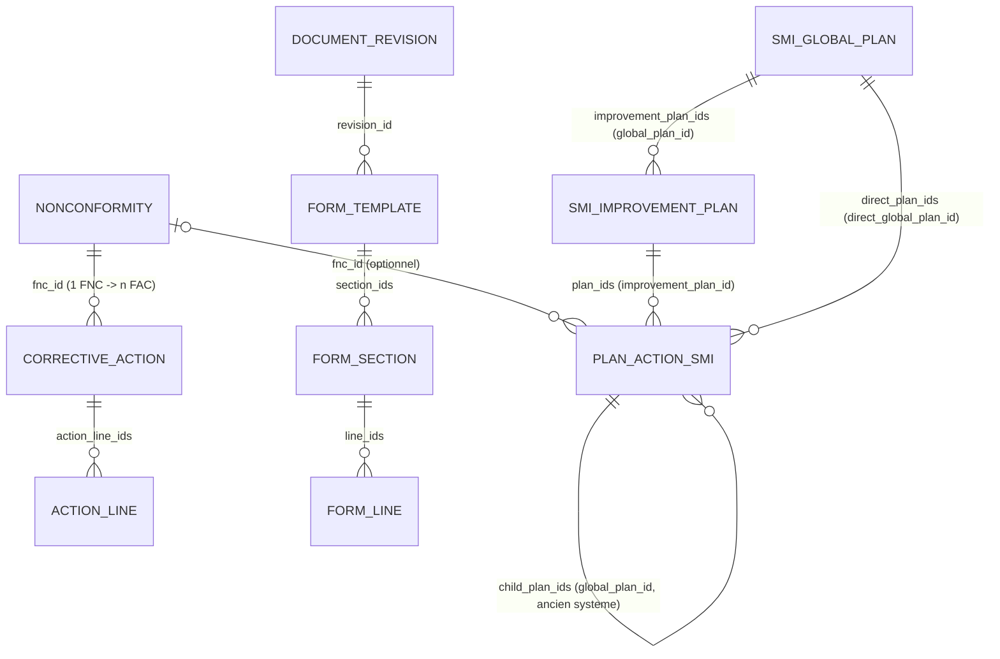
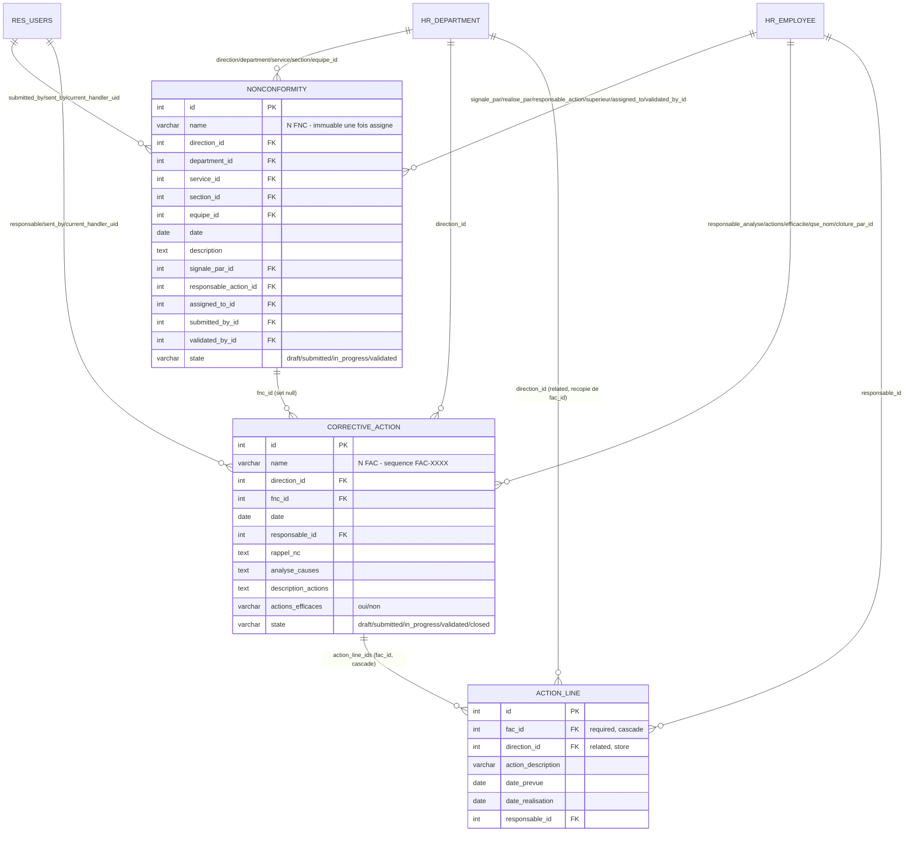
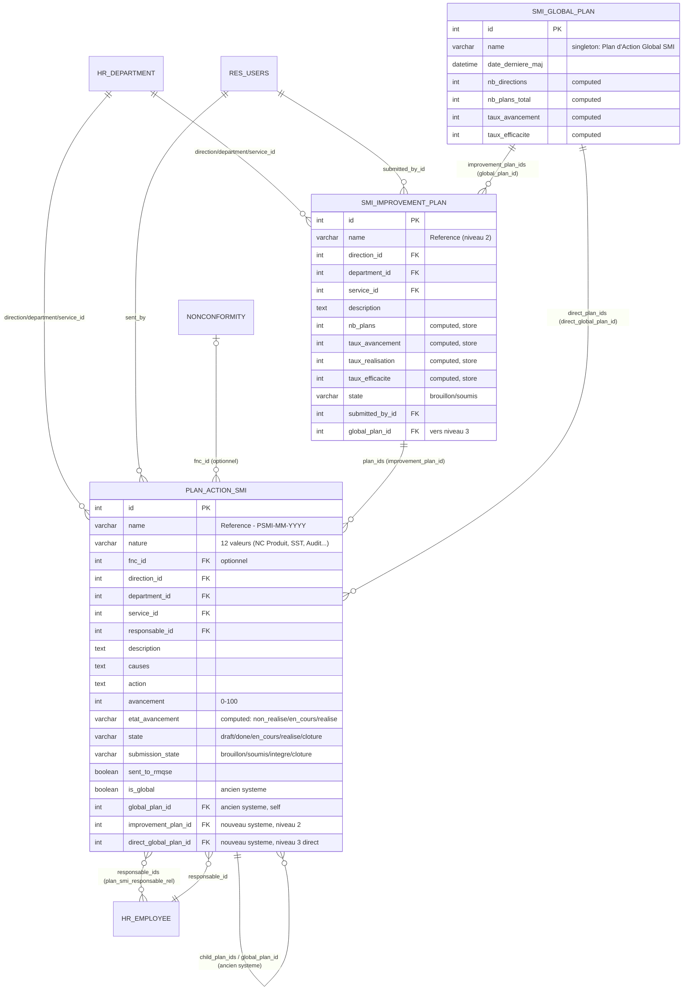
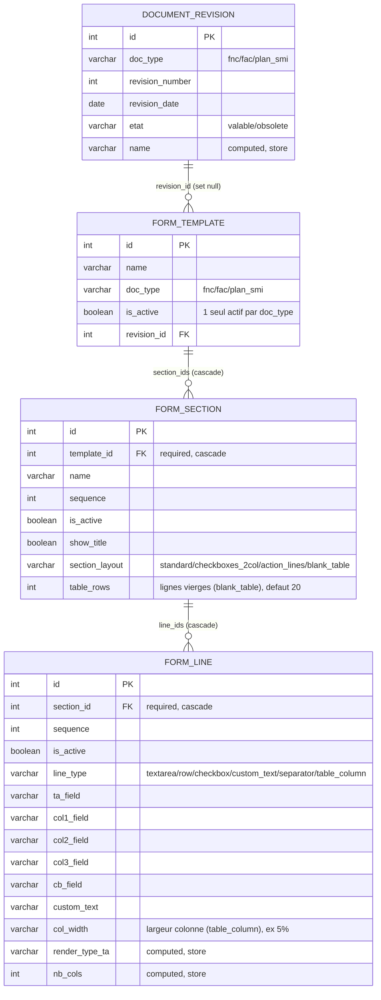

# Schéma de base de données — Module `nc_management` (Odoo 11)

Ce document décrit le schéma de données **réel** du module, déduit du code actuel
(`models/models.py`, `models/smi_global_plan.py`, `models/smi_improvement_plan.py`,
`models/form_template.py`).

---

## 0. Conventions Odoo → PostgreSQL

- Chaque modèle (`_name`) devient une **table** : les points sont remplacés par
  des underscores. Ex. `nc_management.nonconformity` → table
  `nc_management_nonconformity`.
- Toutes les tables ont une clé primaire **`id` (serial)** automatique.
- Tous les modèles ont 4 colonnes techniques automatiques (non répétées dans les
  dictionnaires ci-dessous) :
  `create_uid` (FK → `res_users`), `create_date`, `write_uid` (FK → `res_users`),
  `write_date`.
- `Many2one` → colonne entière `xxx_id` (FK).
- `One2many` → **pas de colonne** côté table « 1 » : c'est juste la vue inverse
  du `Many2one` côté table « N ».
- `Many2many` → table de liaison séparée (2 colonnes FK).
- Les modèles hérités de `mail.thread` / `mail.activity.mixin`
  (`Nonconformity`, `CorrectiveAction`, `PlanActionSmi`, `SmiImprovementPlan`,
  `SmiGlobalPlan`) bénéficient en plus du chatter Odoo standard
  (`mail_message`, `mail_followers`, `mail_activity`, `mail_tracking_value`)
  liés via `res_model` + `res_id` — non détaillés ici car génériques à Odoo.

---

## 1. Vue d'ensemble — diagramme global

Le module se découpe en **4 domaines fonctionnels** :

1. **FNC / FAC** — Fiches de Non-Conformité et Fiches d'Action Corrective
   (`nonconformity`, `corrective_action`, `action_line`)
2. **Plans d'Action SMI** — hiérarchie à 3 niveaux
   (`plan_action_smi`, `smi_improvement_plan`, `smi_global_plan`)
3. **Gabarits de formulaires PDF** — moteur de mise en page configurable
   (`form_template`, `form_section`, `form_line`)
4. **Référentiels / extensions RH** — `nc_type`, `document_revision`,
   extensions de `hr.department` et `hr.job`

Toutes les entités du module pointent abondamment vers 3 modèles **natifs Odoo** :
`hr.department`, `hr.employee`, `res.users` (détaillés dans chaque domaine
ci-dessous).

---

## 2. Domaine 1 — FNC / FAC

### 2.1 Diagramme

### 2.2 Dictionnaire de données

#### `nc_management.nonconformity` (FNC) — table `nc_management_nonconformity`

| Champ | Type | Cible / Contrainte | Description |
|---|---|---|---|
| `name` | Char | requis, unique en pratique | N° FNC, format `ABR-NNN YYYY`, immuable une fois généré |
| `direction_id` | Many2one | `hr.department` (domain `scaek_level=direction`) | Direction émettrice |
| `department_id` | Many2one | `hr.department` (domain `departement`) | Département |
| `service_id` | Many2one | `hr.department` (domain `service`) | Service |
| `section_id` | Many2one | `hr.department` (domain `section`) | Section |
| `equipe_id` | Many2one | `hr.department` (domain `equipe`) | Équipe |
| `service_dpt` | Char | — | Sce/DPT (champ libre) |
| `sce_dpt_computed` | Char | computed, non stocké | Sce/DPT calculé depuis service+département |
| `date` | Date | défaut = aujourd'hui | Date de la FNC |
| `type_nc_produit`…`type_autre` | Boolean ×12 | — | 12 types de NC, **mutuellement exclusifs** (gérés par onchange) |
| `type_autre_preciser` | Char | — | Précision si `type_autre` |
| `description` | Text | requis (contrainte) | Description de la non-conformité |
| `signale_par_id` | Many2one | `hr.employee` | Personne qui signale |
| `date_signalement` | Date | — | Date de signalement |
| `fonction_visa` | Char | — | Fonction et visa (déclenche `submitted` au write) |
| `trait_reprise`…`trait_autre` | Boolean ×6 | — | Type de traitement appliqué |
| `trait_autre_preciser` | Char | — | Précision traitement |
| `action_immediate` | Text | — | Action immédiate |
| `realise_par_id` | Many2one | `hr.employee` | Réalisé par |
| `date_realisation` | Date | — | — |
| `analyse_causes` | Text | — | Analyse des causes |
| `impact` | Text | — | Coût / incidence / risque |
| `fac_ids` | One2many | `corrective_action.fnc_id` | FAC liées (0..n) |
| `fac_reference` | Many2one | `corrective_action`, computed stocké | 1ère FAC liée |
| `fac_number_display` | Char | computed | N° FAC affiché (visible même sans accès FAC) |
| `can_access_fac` | Boolean | computed | L'utilisateur courant peut-il ouvrir la FAC liée |
| `responsable_action_id` | Many2one | `hr.employee` | Responsable de l'action |
| `superieur_id` | Many2one | `hr.employee` | Supérieur hiérarchique (validation) |
| `date_validation` | Date | — | — |
| `signature` | Char | — | — |
| `assigned_to_id` | Many2one | `hr.employee`, tracké | Responsable courant (déclenche `in_progress`) |
| `current_handler_uid` | Many2one | `res.users` | Destinataire courant (routing dashboard) |
| `submitted_by_id` | Many2one | `res.users`, readonly | Auteur de la soumission |
| `validated_by_id` | Many2one | `hr.employee` | Validé par (sup. hiérarchique) |
| `state` | Selection | `draft/submitted/in_progress/validated` | Cycle de vie FNC |
| `date_in_progress` | Date | — | — |
| `date_envoi` | Date | readonly | Date d'envoi |
| `sent_by_id` | Many2one | `res.users`, readonly | Envoyé par |

#### `nc_management.corrective_action` (FAC) — table `nc_management_corrective_action`

| Champ | Type | Cible / Contrainte | Description |
|---|---|---|---|
| `name` | Char | requis, readonly, séquence `FAC-XXXX` | N° FAC |
| `direction_id` | Many2one | `hr.department` (domain `direction`) | — |
| `date` | Date | défaut = aujourd'hui | — |
| `fnc_id` | Many2one | `nonconformity`, `ondelete=set null`, indexé | FNC d'origine |
| `ref_document` | Char | — | N° FNC ou autre doc (saisi libre) |
| `fnc_ref_display` | Char | computed | Affichage N° FNC ou autre doc |
| `date_fnc` | Date | — | — |
| `responsable_id` | Many2one | `res.users`, indexé | Responsable de l'action — défaut = utilisateur courant |
| `rappel_nc` | Text | — | Rappel de la NC (auto-rempli depuis FNC) |
| `analyse_causes` | Text | — | — |
| `responsable_analyse_id` | Many2one | `hr.employee` | — |
| `date_analyse` | Date | — | — |
| `visa_analyse` | Char | — | (déclenche `submitted` au write) |
| `description_actions` | Text | — | — |
| `action_line_ids` | One2many | `action_line.fac_id` | Lignes d'actions décidées |
| `responsable_actions_id` | Many2one | `hr.employee` | — |
| `date_actions` | Date | — | — |
| `visa_actions` | Char | — | (déclenche `in_progress` au write) |
| `actions_efficaces` | Selection | `oui/non` | — |
| `responsable_efficacite_id` | Many2one | `hr.employee` | — |
| `qse_nom_id` | Many2one | `hr.employee` | Responsable QSE |
| `qse_date` | Date | — | — |
| `qse_visa` | Char | — | (déclenche `validated` au write) |
| `verification_efficacite` | Text | — | — |
| `extension_possible` | Selection | `non/oui` | — |
| `cloture_par_id` | Many2one | `hr.employee` | — |
| `date_cloture` | Date | — | auto-rempli à la clôture |
| `visa_cloture` | Char | — | (déclenche `closed` au write) |
| `date_envoi` | Date | readonly | — |
| `sent_by_id` | Many2one | `res.users`, readonly | — |
| `current_handler_uid` | Many2one | `res.users` | Routing dashboard |
| `state` | Selection | `draft/submitted/in_progress/validated/closed` | Cycle de vie FAC |
| `date_validated` | Date | — | Date validation QSE |

#### `nc_management.action_line` — table `nc_management_action_line`

| Champ | Type | Cible / Contrainte | Description |
|---|---|---|---|
| `fac_id` | Many2one | `corrective_action`, **requis**, `ondelete=cascade`, indexé | FAC parente |
| `direction_id` | Many2one | `hr.department`, **related** `fac_id.direction_id`, stocké, readonly | Recopié de la FAC |
| `action_description` | Char | — | — |
| `date_prevue` | Date | — | — |
| `date_realisation` | Date | — | — |
| `responsable_id` | Many2one | `hr.employee` | — |

---

## 3. Domaine 2 — Plans d'Action SMI (hiérarchie à 3 niveaux)

L'architecture actuelle (différente de l'ancienne version `plan_level`)
sépare les 3 niveaux en **3 modèles distincts** :

- **Niveau 1** `plan_action_smi` : plan d'action individuel (créé par un NC User)
- **Niveau 2** `smi_improvement_plan` : Plan d'Amélioration **par direction**,
  regroupe les plans niveau 1 d'une direction avant envoi à la RMQSE
- **Niveau 3** `smi_global_plan` : Plan d'Action Global SMI, **singleton**
  unique de la RMQSE, consolide tous les plans niveau 2 + plans ajoutés
  directement par la RMQSE

> ⚠️ **Champs hérités d'un ancien système** (`is_global`, `global_plan_id`,
> `child_plan_ids`, `version_number`, `mois_reception`) sont **conservés sur
> `plan_action_smi`** pour compatibilité ascendante. `_compute_is_integrated`
> teste les deux systèmes (ancien `global_plan_id` OU nouveau
> `improvement_plan_id.global_plan_id`).

### 3.1 Diagramme

### 3.2 Dictionnaire de données

#### `nc_management.plan_action_smi` (Niveau 1) — table `nc_management_plan_action_smi`

| Champ | Type | Cible / Contrainte | Description |
|---|---|---|---|
| `name` | Char | requis, readonly, défaut `New` | Référence du plan |
| `nature` | Selection | 12 valeurs (NC Produit, Réclamation, SST, Audit…) | Catégorie de plan |
| `fnc_id` | Many2one | `nonconformity` | FNC d'origine (optionnel) |
| `reference` | Char | — | Référence libre |
| `direction_id` / `department_id` / `service_id` | Many2one | `hr.department` (domains direction/departement/service) | Rattachement organisationnel |
| `is_late` | Boolean | computed, stocké | En retard |
| `is_integrated` | Char | computed, stocké | "Oui"/"Non" — intégré au plan d'amélioration (ancien ou nouveau système) |
| `description` | Text | tracké | Description / objectif |
| `causes` | Text | tracké | — |
| `action` | Text | tracké | — |
| `responsable_id` | Many2one | `hr.employee`, tracké | Responsable principal |
| `responsable_ids` | Many2many | `hr.employee` via `plan_smi_responsable_rel(plan_id, employee_id)` | Co-responsables |
| `moyens` | Char | — | Moyens nécessaires |
| `duree_estimee` | Char | — | — |
| `date_prevue` | Date | tracké | — |
| `date_lancement` | Date | — | — |
| `date_realisation` | Date | tracké | — |
| `avancement` | Integer | défaut 0 | % avancement |
| `avancement_choice` | Selection | computed/inverse, non stocké | Sélecteur UI 0/25/50/75/100% |
| `duree_reelle` | Char | — | — |
| `critere_efficacite` | Text | — | — |
| `efficacite` | Selection | `oui/non`, tracké | — |
| `remarque` | Text | — | Si non efficace |
| `state` | Selection | `draft/done/en_cours/realise/cloture` | Avancement |
| `etat_avancement` | Selection | computed, stocké | Dérivé de `avancement` |
| `submission_state` | Selection | `brouillon/soumis/integre/cloture` | État côté workflow RMQSE |
| `sent_to_rmqse` | Boolean | readonly | — |
| `date_envoi` | Datetime | readonly | — |
| `sent_by` | Many2one | `res.users`, readonly | — |
| `is_global` | Boolean | **ancien système** | True = ce record est un "Plan d'Amélioration" global |
| `global_plan_id` | Many2one | self, domain `is_global=True`, `ondelete=set null`, indexé — **ancien système** | Plan global parent |
| `child_plan_ids` | One2many | self, inverse `global_plan_id` — **ancien système** | Plans intégrés |
| `mois_reception` | Date | — | Date de création |
| `date_maj` | Datetime | readonly | Dernière mise à jour |
| `version_number` | Integer | défaut 1 | — |
| `filter_nature` / `filter_direction_id` | Selection / Many2one | stockés mais usage UI uniquement | Filtres d'affichage des plans intégrés |
| `child_plan_ids_display` | Many2many | computed, non stocké | `child_plan_ids` filtrés |
| `improvement_plan_id` | Many2one | `smi_improvement_plan`, `ondelete=set null`, indexé, tracké — **nouveau système** | Plan d'amélioration de direction (niveau 2) |
| `direct_global_plan_id` | Many2one | `smi_global_plan`, `ondelete=set null`, indexé — **nouveau système** | Lien direct niveau 3 (ajout RMQSE) |
| `name_display` | Char | computed, non stocké | — |
| `date_consultation` | Date | — | Vue historique à une date donnée |
| `historique_html` / `analyse_html` | Html | computed, non stocké | Rendus HTML (tableaux/graphiques) |

#### `nc_management.smi_improvement_plan` (Niveau 2 — par direction) — table `nc_management_smi_improvement_plan`

| Champ | Type | Cible / Contrainte | Description |
|---|---|---|---|
| `name` | Char | requis, readonly, défaut `New` | Référence du plan de direction |
| `direction_id` | Many2one | `hr.department` (domain `direction`), tracké | — |
| `department_id` | Many2one | `hr.department` (domain `departement`) | — |
| `service_id` | Many2one | `hr.department` (domain `service`) | — |
| `description` | Text | tracké | Objet / périmètre |
| `plan_ids` | One2many | `plan_action_smi.improvement_plan_id` | Plans niveau 1 rattachés |
| `nb_plans`, `nb_en_cours`, `nb_realises`, `nb_non_realises`, `nb_clotures` | Integer | computed, stockés | Statistiques |
| `taux_avancement`, `taux_realisation`, `taux_efficacite` | Integer | computed, stockés | Indicateurs (%) |
| `date_ouverture` | Date | — | Date de création |
| `date_consultation` | Date | — | Vue historique |
| `historique_html` | Html | computed, non stocké | — |
| `state` | Selection | `brouillon/soumis`, tracké | — |
| `date_soumission` | Datetime | readonly | — |
| `submitted_by_id` | Many2one | `res.users`, readonly | — |
| `global_plan_id` | Many2one | `smi_global_plan`, readonly, `ondelete=set null`, indexé | Plan global parent (niveau 3) |

#### `nc_management.smi_global_plan` (Niveau 3 — singleton RMQSE) — table `nc_management_smi_global_plan`

| Champ | Type | Cible / Contrainte | Description |
|---|---|---|---|
| `name` | Char | requis, défaut `"Plan d'Action Global SMI"`, tracké | — |
| `date_derniere_maj` | Datetime | readonly, auto-mis à jour au `write()` | — |
| `improvement_plan_ids` | One2many | `smi_improvement_plan.global_plan_id`, readonly | Plans de direction soumis |
| `direct_plan_ids` | One2many | `plan_action_smi.direct_global_plan_id` | Plans ajoutés directement par la RMQSE |
| `date_consultation` | Date | — | Vue historique |
| `vue_historique` | Boolean | computed, non stocké | — |
| `historique_html` | Html | computed, non stocké | — |
| `nb_directions`, `nb_plans_total`, `nb_en_cours`, `nb_realises`, `nb_clotures` | Integer | computed, non stockés | Statistiques globales (calculées à la volée sur `_get_all_plans()`) |
| `taux_avancement`, `taux_efficacite` | Integer | computed, non stockés | Indicateurs (%) |

#### Table de liaison `plan_smi_responsable_rel`

| Colonne | Type | Cible |
|---|---|---|
| `plan_id` | int | FK → `nc_management_plan_action_smi.id` |
| `employee_id` | int | FK → `hr_employee.id` |

---

## 4. Domaine 3 — Gabarits de formulaires PDF

Système configurable de mise en page des rapports FNC/FAC/Plan SMI
(menu "Gabarits").

### 4.1 Diagramme

### 4.2 Dictionnaire de données

#### `nc_management.form_template` — table `nc_management_form_template`

| Champ | Type | Cible / Contrainte | Description |
|---|---|---|---|
| `name` | Char | requis | Nom du gabarit |
| `doc_type` | Selection | `fnc/fac/plan_smi`, requis | Type de document |
| `is_active` | Boolean | défaut False | Un seul gabarit actif par `doc_type` (`action_activate`) |
| `revision_id` | Many2one | `document_revision`, `ondelete=set null` | Révision liée |
| `section_ids` | One2many | `form_section.template_id` | Sections du gabarit |
| `section_count` | Integer | computed, non stocké | — |

#### `nc_management.form_section` — table `nc_management_form_section`

| Champ | Type | Cible / Contrainte | Description |
|---|---|---|---|
| `template_id` | Many2one | `form_template`, **requis**, `ondelete=cascade` | — |
| `name` | Char | requis | Titre de section |
| `sequence` | Integer | défaut 10 | Ordre |
| `is_active` | Boolean | défaut True | — |
| `show_title` | Boolean | défaut True | — |
| `section_layout` | Selection | `standard/checkboxes_2col/action_lines/blank_table`, requis | Disposition |
| `table_rows` | Integer | défaut 20 | Nb de lignes vierges à imprimer (`blank_table`, Plan SMI) |
| `line_ids` | One2many | `form_line.section_id` | Lignes |
| `line_count` | Integer | computed, non stocké | — |

#### `nc_management.form_line` — table `nc_management_form_line`

| Champ | Type | Cible / Contrainte | Description |
|---|---|---|---|
| `section_id` | Many2one | `form_section`, **requis**, `ondelete=cascade` | — |
| `sequence` | Integer | défaut 10 | — |
| `is_active` | Boolean | défaut True | — |
| `line_type` | Selection | `textarea/row/checkbox/custom_text/separator/table_column`, requis | Type de ligne |
| `ta_field`, `ta_label`, `ta_height` | Selection/Char/Selection | — | Config zone de texte |
| `col1_field/label`, `col2_field/label`, `col3_field/label` | Selection/Char | — | Config rangée 1-3 colonnes |
| `cb_field`, `cb_label`, `cb_column`, `cb_extra_field`, `cb_extra_label` | Selection/Char/Selection/Selection/Char | — | Config case à cocher |
| `custom_text` | Char | — | Texte fixe (ou en-tête de colonne si `table_column`) |
| `col_width` | Char | — | Largeur de colonne CSS (ex. `5%`), `table_column` uniquement |
| `render_type_ta/col1/col2/col3/cb` | Char | computed, stockés | Type de rendu déduit du champ choisi (`FIELD_RENDER_TYPES`) |
| `nb_cols` | Integer | computed, stocké | 1 à 3 |

`ta_field`, `col*_field`, `cb_field`, `cb_extra_field` utilisent tous la même
liste `ALL_FIELD_SELECTION` (≈ 50 champs FNC + FAC sélectionnables).

### 4.3 Gabarit Plan SMI (`blank_table`)

Le PDF "Plan d'Action d'Amélioration SMI" (`report_plan_smi_revision_content`,
bouton sur Révision Documents) est un **tableau vierge à imprimer** (pas un
formulaire lié à un enregistrement). Son gabarit (`doc_type='plan_smi'`)
contient une seule section `section_layout='blank_table'` :

- chaque `form_line` actif (`line_type='table_column'`, triés par `sequence`)
  représente **une colonne** du tableau : `custom_text` = en-tête, `col_width`
  = largeur CSS (ex. `11%`)
- `table_rows` = nombre de lignes vierges imprimées dans `<tbody>`

Gabarit par défaut : `data/default_plan_smi_template.xml`
(`form_template_plan_smi_default`, lié à `rev_plan_smi_02`, 16 colonnes
répliquant le tableau d'origine).

---

## 5. Référentiels & extensions

#### `nc_management.nc_type` — table `nc_management_nc_type`

Table de paramétrage utilisée par le wizard de génération de numéro FNC.
Pas de FK entrante/sortante avec les autres modèles (les booléens `type_*`
de `nonconformity` sont indépendants).

| Champ | Type | Cible / Contrainte | Description |
|---|---|---|---|
| `name` | Char | requis | Produit / Abréviation |
| `code` | Char | requis, **unique** (`_sql_constraints`) | Code abréviation (ex. CLYC, CIM, REC, SST) |
| `category` | Selection | 10 valeurs (`type_nc_produit`, `type_reclamation`, …), requis | Catégorie de NC associée |

#### `nc_management.document_revision` — table `nc_management_document_revision`

| Champ | Type | Cible / Contrainte | Description |
|---|---|---|---|
| `doc_type` | Selection | `fnc/fac/plan_smi`, requis | Type de document |
| `revision_number` | Integer | requis | N° de révision |
| `revision_date` | Date | requis, défaut aujourd'hui | — |
| `reference` | Char | — | Référence du document papier |
| `description` | Text | — | Modification apportée |
| `etat` | Selection | `valable/obsolete`, requis, défaut `obsolete` | Une seule "valable" par `doc_type` (auto-géré dans `create`/`write`) |
| `revision_number_link` | Html | computed | Lien vers le PDF de la révision |
| `name` | Char | computed, stocké | Ex. `"FNC - Rev 03"` |

#### `hr.department` (extension)

| Champ | Type | Description |
|---|---|---|
| `scaek_level` | Selection | `pdg/direction/departement/service/section/equipe` — niveau hiérarchique SCAEK |
| `scaek_code` | Char | Code court |

#### `hr.job` (extension)

| Champ | Type | Description |
|---|---|---|
| `is_linked_to_pdg` | Boolean | Poste reportant directement au P-DG |

#### `nc_management.dashboard`

Modèle **sans champ stocké** — sert uniquement de point d'entrée RPC pour le
widget JS du dashboard (`get_stats`, `get_plan_smi_stats`,
`get_direction_details`, `get_sender_info`). La table existe mais ne contient
aucune colonne métier.

#### `res.users` (extension)

Aucun nouveau champ — surcharge de `write()` pour répercuter le changement de
`lang` sur le `partner_id` associé.

---

## 6. Remarques de conception

- **Doublon historique sur `plan_action_smi`** : `is_global` /
  `global_plan_id` / `child_plan_ids` (ancien système 1 niveau) coexistent
  avec `improvement_plan_id` / `direct_global_plan_id` (nouveau système 3
  niveaux). Si l'ancien système n'est plus utilisé en pratique, ces 3 champs
  pourraient être supprimés pour simplifier le schéma — mais vérifier d'abord
  qu'aucune donnée existante (et aucune vue/wizard) n'en dépend encore.
- **`smi_global_plan` est censé être un singleton** (un seul enregistrement
  pour toute l'usine) : ce n'est pas imposé au niveau base de données
  (pas de contrainte `unique` ni de `_sql_constraints`), seulement par
  convention applicative.
- **Indexation** : `fnc_id`, `responsable_id` (FAC), `global_plan_id`,
  `improvement_plan_id`, `direct_global_plan_id` sont indexés — cohérent avec
  leur usage fréquent dans les domaines de recherche/règles `ir.rule`.
- **`nc_management.nc_type`** est un référentiel autonome : il alimente le
  wizard de numérotation mais n'est pas lié par FK aux 12 booléens `type_*`
  de `nonconformity` — une évolution possible serait de remplacer ces 12
  booléens par un Many2one vers `nc_type` (plus extensible, mais impact UI
  important sur les formulaires/gabarits existants).
