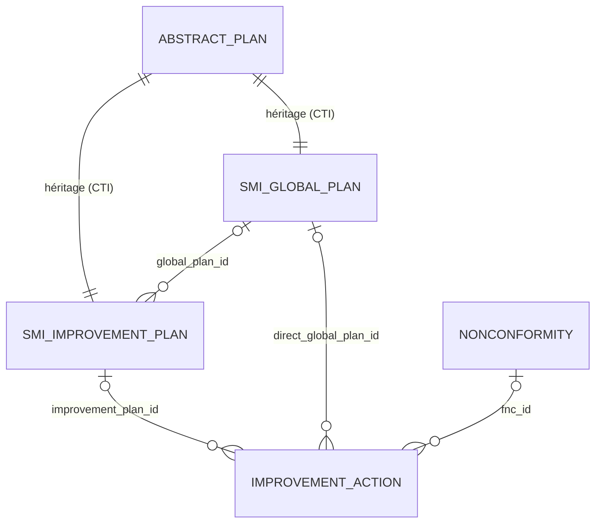
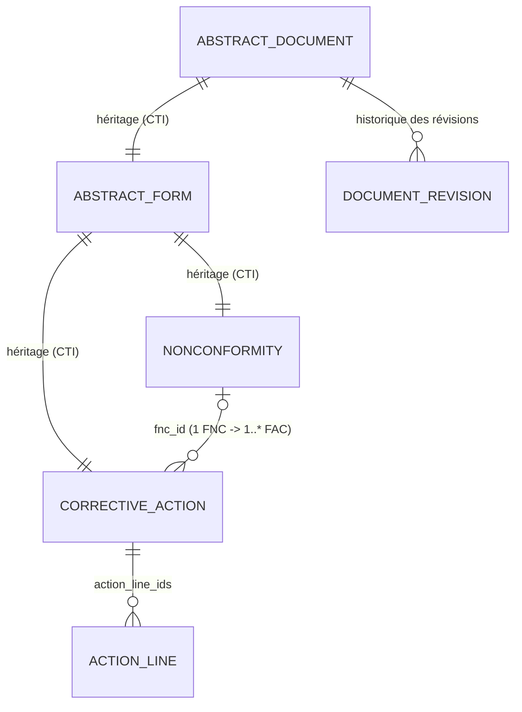
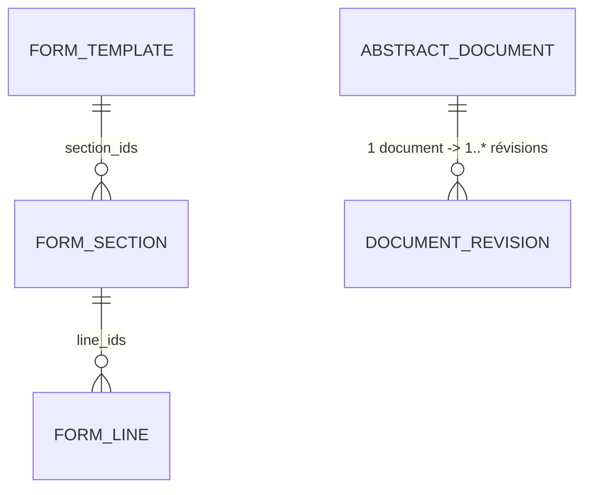

# Schéma de base de données — dérivé du diagramme de classes (logique métier)

Ce document traduit en **schéma relationnel** le diagramme de classes UML
fourni (4 zones : *Plans d'Action SMI*, *Documents FNC/FAC*, *Gabarits &
Révisions*, *Dashboard*).

Il s'agit du schéma **cible / logique** correspondant au diagramme de
classes — il n'est **pas modifié ni corrigé** par rapport à ce diagramme :
les noms d'attributs et les cardinalités sont repris tels que dessinés.

---

## 0. Conventions de traduction UML → relationnel

- **Héritage (généralisation) → Class Table Inheritance (CTI)** : chaque
  classe abstraite (`AbstractPlan`, `AbstractDocument`, `AbstractForm`)
  devient sa **propre table**. Chaque sous-classe concrète a une table dont
  la **clé primaire est aussi une clé étrangère** vers la table de la classe
  parente (relation 1-1, `ON DELETE CASCADE`). Le type concret d'une ligne
  de la table abstraite se déduit en regardant dans quelle table fille son
  `id` existe.
- **Attribut de type "collection" (`plan_ids`, `direct_plan_ids`,
  `action_line_ids`, `section_ids`, `line_ids`...)** : ne devient **pas une
  colonne**. Il est représenté par la clé étrangère portée par la table du
  côté "plusieurs" de l'association correspondante.
- **Association simple (`Many2one`)** → colonne `..._id` de type `INTEGER`,
  clé étrangère.
- **Composition (◆)** → la FK côté "enfant" est `NOT NULL` +
  `ON DELETE CASCADE`.
- **Agrégation (◇)** → la FK côté "rattaché" est `NULL` autorisé +
  `ON DELETE SET NULL`.
- **Attributs "exemple" annotés dans le diagramme** (`nc_produit`,
  `type_nc_produit`, `trait_reprise`) → traduits en une seule colonne
  catégorielle (`VARCHAR` + `CHECK`/ENUM), puisque l'annotation précise
  qu'il s'agit d'**une valeur parmi N** d'une même famille.
- **Méthodes** (`action_xxx()`, `_get_all_plans()`, `_obsolete_others()`...)
  → logique applicative, **aucune colonne** correspondante.
- **Entités externes** (`hr.department`, `hr.employee`, `res.users`) : non
  redéfinies ici (tables natives Odoo), seulement référencées en FK — voir
  §6.

---

## 1. Zone "Plans d'Action SMI"

### 1.1 Vue d'ensemble

### 1.2 Table `abstract_plan`

Classe abstraite — attributs/statistiques communs aux deux niveaux de plan.

| Colonne | Type | Contrainte | Description |
|---|---|---|---|
| `id` | SERIAL | **PK** | — |
| `date_ouverture` | DATE | — | Date de création du plan |
| `date_derniere_maj` | TIMESTAMP | — | Dernière mise à jour |
| `date_consultation` | DATE | — | Vue historique à une date donnée |
| `nb_plans_total` | INTEGER | — | Nombre total de plans rattachés |
| `nb_en_cours` | INTEGER | — | Nombre de plans en cours |
| `nb_realises` | INTEGER | — | Nombre de plans réalisés |
| `nb_non_realises` | INTEGER | — | Nombre de plans non réalisés |
| `taux_efficacite` | INTEGER | 0–100 | % d'efficacité |
| `taux_realisation` | INTEGER | 0–100 | % de réalisation |
| `taux_avancement` | INTEGER | 0–100 | % d'avancement global |
| `historique_html` | TEXT | calculé | Rendu HTML de la vue historique |

> `plan_ids` (attribut du diagramme) n'est pas une colonne : il correspond
> aux lignes de `improvement_action` dont `improvement_plan_id` /
> `direct_global_plan_id` pointe vers cette ligne.
> Méthodes `action_consolider()`, `action_open_consulter_version_wizard()`,
> `action_retour_actuel()`, `action_open_my_plan()` : logique applicative.

### 1.3 Table `smi_improvement_plan` *(hérite de `abstract_plan`)*

| Colonne | Type | Contrainte | Description |
|---|---|---|---|
| `id` | INTEGER | **PK**, **FK** → `abstract_plan.id`, `ON DELETE CASCADE` | Héritage CTI |
| `state` | VARCHAR | ENUM | État du plan d'amélioration (direction) |
| `date_soumission` | TIMESTAMP | — | Date de soumission à la RMQSE |
| `submitted_by` | INTEGER | FK → `res_users.id` | Utilisateur ayant soumis |
| `global_plan_id` | INTEGER | FK → `smi_global_plan.id`, NULL, `ON DELETE SET NULL` | Plan global rattaché |

Méthode `action_soumettre()` : logique applicative (transition d'état +
rattachement à `smi_global_plan`).

### 1.4 Table `smi_global_plan` *(hérite de `abstract_plan`)*

| Colonne | Type | Contrainte | Description |
|---|---|---|---|
| `id` | INTEGER | **PK**, **FK** → `abstract_plan.id`, `ON DELETE CASCADE` | Héritage CTI |

Aucune colonne propre supplémentaire. `direct_plan_ids` = vue inverse de
`improvement_action.direct_global_plan_id`. Méthode `_get_all_plans()` :
logique applicative (union des plans des deux relations entrantes).

### 1.5 Table `improvement_action`

| Colonne | Type | Contrainte | Description |
|---|---|---|---|
| `id` | SERIAL | **PK** | — |
| `name` | VARCHAR | — | Référence du plan d'action |
| `state` | VARCHAR | ENUM | État d'avancement |
| `nature` | VARCHAR | ENUM, 12 valeurs *(`nc_produit` = 1 valeur parmi 12, cf. annotation)* | Catégorie / nature du plan |
| `fnc_id` | INTEGER | FK → `nonconformity.id`, NULL, `ON DELETE SET NULL` | FNC d'origine (optionnelle) |
| `reference` | VARCHAR | — | Référence libre |
| `description` | TEXT | — | Description / objectif |
| `causes` | TEXT | — | Causes |
| `action` | TEXT | — | Action décidée |
| `date_prevue` | DATE | — | — |
| `date_lancement` | DATE | — | — |
| `date_realisation` | DATE | — | — |
| `avancement` | INTEGER | 0–100 | % avancement |
| `efficacite` | VARCHAR | ENUM `oui` / `non` | — |
| `responsable_id` | INTEGER | FK → `hr_employee.id` | Responsable du plan |
| `critere_efficacite` | TEXT | — | — |
| `remarque` | TEXT | — | Remarque si non efficace |
| `etat_avancement` | VARCHAR | ENUM, calculé | Dérivé de `avancement` |
| `is_integrated` | VARCHAR | calculé | "Oui"/"Non" — intégré à un plan d'amélioration |
| `direction_id` | INTEGER | FK → `hr_department.id` | *(annotation hr.departement)* |
| `department_id` | INTEGER | FK → `hr_department.id` | *(annotation hr.departement)* |
| `service_id` | INTEGER | FK → `hr_department.id` | *(annotation hr.departement)* |
| `improvement_plan_id` | INTEGER | FK → `smi_improvement_plan.id`, NULL, `ON DELETE SET NULL` | Rattachement niveau 2 |
| `direct_global_plan_id` | INTEGER | FK → `smi_global_plan.id`, NULL, `ON DELETE SET NULL` | Rattachement direct niveau 3 (RMQSE) |

---

## 2. Zone "Documents FNC/FAC"

### 2.1 Vue d'ensemble

### 2.2 Table `abstract_document`

| Colonne | Type | Contrainte | Description |
|---|---|---|---|
| `id` | SERIAL | **PK** | — |
| `name` | VARCHAR | — | N° de la fiche (FNC / FAC) |
| `state` | VARCHAR | ENUM | État générique de la fiche |

Méthodes `action_print()`, `action_delete()`, `action_edit()` : opérations
CRUD/impression génériques, aucune colonne.

### 2.3 Table `abstract_form` *(hérite de `abstract_document`)*

| Colonne | Type | Contrainte | Description |
|---|---|---|---|
| `id` | INTEGER | **PK**, **FK** → `abstract_document.id`, `ON DELETE CASCADE` | Héritage CTI |
| `date` | DATE | — | Date de la fiche |
| `date_env` | TIMESTAMP | — | Date d'envoi |
| `sent_by_id` | INTEGER | FK → `res_users.id` | Envoyé par |

Méthode `action_open_send_wizard()` : logique applicative (ouvre
l'assistant d'envoi).

### 2.4 Table `nonconformity` *(hérite de `abstract_form`)*

| Colonne | Type | Contrainte | Description |
|---|---|---|---|
| `id` | INTEGER | **PK**, **FK** → `abstract_form.id`, `ON DELETE CASCADE` | Héritage CTI |
| `type_nc` | VARCHAR | ENUM, 10 valeurs *(`type_nc_produit` = 1 valeur parmi 10, cf. annotation : +9 autres)* | Type de non-conformité |
| `description` | TEXT | — | Description de la non-conformité |
| `date_signalement` | DATE | — | — |
| `action_immediate` | TEXT | — | — |
| `realise_par_id` | INTEGER | FK → `hr_employee.id` | Réalisé par |
| `date_realisation` | DATE | — | — |
| `analyse_causes` | TEXT | — | — |
| `traitement` | VARCHAR | ENUM, 6 valeurs *(`trait_reprise` = 1 valeur parmi 6, cf. annotation : +5 autres)* | Type de traitement appliqué |
| `impact` | TEXT | — | Coût / incidence / risque |
| `date_validation` | DATE | — | — |
| `fac_id` | INTEGER | FK → `corrective_action.id`, NULL | FAC liée (1ʳᵉ FAC générée) |
| `submitted_by_id` | INTEGER | FK → `res_users.id` | Soumis par |
| `signale_par_id` | INTEGER | FK → `hr_employee.id` *(annotation hr.employee)* | Personne qui signale |
| `fonction_visa` | VARCHAR | *(annotation hr.employee, mais champ texte)* | Fonction et visa (texte libre) |
| `superieur_id` | INTEGER | FK → `hr_employee.id` *(annotation hr.employee)* | Supérieur hiérarchique |
| `responsable_action_id` | INTEGER | FK → `hr_employee.id` *(annotation hr.employee)* | Responsable de l'action |
| `signature` | VARCHAR | *(annotation hr.employee, mais champ texte)* | Signature (texte libre) |

Méthodes `action_valider_fnc()`, `action_open_number_wizard()` : logique
applicative.

### 2.5 Table `corrective_action` *(hérite de `abstract_form`)*

| Colonne | Type | Contrainte | Description |
|---|---|---|---|
| `id` | INTEGER | **PK**, **FK** → `abstract_form.id`, `ON DELETE CASCADE` | Héritage CTI |
| `ref_document` | VARCHAR | — | N° FNC ou autre document |
| `date_analyse` | DATE | — | — |
| `description_actions` | TEXT | — | — |
| `date_actions` | DATE | — | — |
| `actions_efficaces` | VARCHAR | ENUM `oui` / `non` | — |
| `verification_efficacite` | TEXT | — | — |
| `extension_possible` | VARCHAR | ENUM `non` / `oui` | — |
| `qse_date` | DATE | — | — |
| `date_validated` | DATE | — | Date validation QSE |
| `date_cloture` | DATE | — | — |
| `analyse_causes` | TEXT | — | — |
| `responsable_analyse_id` | INTEGER | FK → `hr_employee.id` *(annotation hr.employee)* | — |
| `responsable_action_id` | INTEGER | FK → `hr_employee.id` *(annotation hr.employee)* | Responsable des actions |
| `responsable_efficacite_id` | INTEGER | FK → `hr_employee.id` *(annotation hr.employee)* | — |
| `qse_nom_id` | INTEGER | FK → `hr_employee.id` *(annotation hr.employee)* | — |
| `cloture_par_id` | INTEGER | FK → `hr_employee.id` *(annotation hr.employee)* | — |
| `visa_cloture` | VARCHAR | *(annotation hr.employee, mais champ texte)* | — |
| `qse_visa` | VARCHAR | *(annotation hr.employee, mais champ texte)* | — |
| `visa_action` | VARCHAR | *(annotation hr.employee, mais champ texte)* | — |
| `visa_analyse` | VARCHAR | *(annotation hr.employee, mais champ texte)* | — |

> L'attribut `fnc_id` montré dans le diagramme côté `CorrectiveAction`
> représente le **rôle inverse** de l'association `nonconformity.fac_id`
> (cf. cardinalités `0,1` / `1,*`) : ce n'est **pas une colonne distincte**,
> une seule FK physique suffit (portée par `nonconformity.fac_id`).

Méthode `action_cloturer_fac()` : logique applicative (transition vers
l'état clôturé).

### 2.6 Table `action_line`

| Colonne | Type | Contrainte | Description |
|---|---|---|---|
| `id` | SERIAL | **PK** | — |
| `fac_id` | INTEGER | **FK** → `corrective_action.id`, `NOT NULL`, `ON DELETE CASCADE` | FAC parente (composition) |
| `action_description` | VARCHAR | — | — |
| `date_prevue` | DATE | — | — |
| `date_realisation` | DATE | — | — |
| `responsable_id` | INTEGER | FK → `hr_employee.id` | — |

> Cardinalité `1,*` côté `ActionLine` (≥ 1 ligne par FAC) : non imposable
> par une simple FK ; nécessiterait un contrôle applicatif ou une contrainte
> différée (`DEFERRABLE`).

---

## 3. Zone "Gabarits & Révisions"

### 3.1 Vue d'ensemble

### 3.2 Table `form_template`

| Colonne | Type | Contrainte | Description |
|---|---|---|---|
| `id` | SERIAL | **PK** | — |
| `name` | VARCHAR | — | Nom du gabarit |
| `doc_type` | VARCHAR | ENUM `fnc` / `fac` / `plan_smi` | Type de document |
| `is_active` | BOOLEAN | — | Gabarit actif pour ce `doc_type` |
| `section_count` | INTEGER | calculé | Nombre de sections |

Méthodes `action_apercu_gabarit()`, `action_activate()` : logique
applicative.

### 3.3 Table `form_section`

| Colonne | Type | Contrainte | Description |
|---|---|---|---|
| `id` | SERIAL | **PK** | — |
| `template_id` | INTEGER | **FK** → `form_template.id`, `NOT NULL`, `ON DELETE CASCADE` | Gabarit parent (composition) |
| `name` | VARCHAR | — | Titre de section |
| `sequence` | INTEGER | — | Ordre |
| `is_active` | BOOLEAN | — | — |
| `show_title` | BOOLEAN | — | — |
| `section_layout` | VARCHAR | ENUM | Disposition |
| `table_rows` | INTEGER | — | Nb de lignes vierges |
| `line_count` | INTEGER | calculé | Nombre de lignes actives |

### 3.4 Table `form_line`

| Colonne | Type | Contrainte | Description |
|---|---|---|---|
| `id` | SERIAL | **PK** | — |
| `section_id` | INTEGER | **FK** → `form_section.id`, `NOT NULL`, `ON DELETE CASCADE` | Section parente (composition) |
| `sequence` | INTEGER | — | Ordre |
| `is_active` | BOOLEAN | — | — |
| `line_type` | VARCHAR | ENUM | Type de ligne |
| `custom_text` | VARCHAR | — | Texte fixe |
| `col_width` | VARCHAR | — | Largeur colonne (ex. `5%`) |
| `render_type_ta` | VARCHAR | calculé | Type de rendu déduit |
| `nb_cols` | INTEGER | calculé | 1 à 3 |

### 3.5 Table `document_revision`

| Colonne | Type | Contrainte | Description |
|---|---|---|---|
| `id` | SERIAL | **PK** | — |
| `document_id` | INTEGER | **FK** → `abstract_document.id`, `NOT NULL`, `ON DELETE CASCADE` | Document concerné (composition, 1 doc → 1..* révisions) |
| `doc_type` | VARCHAR | ENUM `fnc` / `fac` / `plan_smi` | Type de document |
| `revision_number` | INTEGER | — | N° de révision |
| `revision_date` | DATE | — | — |
| `reference` | VARCHAR | — | Référence du document papier |
| `description` | TEXT | — | Modification apportée |
| `revision_number_link` | TEXT | calculé | Lien vers le PDF de la révision |

Méthode `_obsolete_others()` *(diagramme : `_obsoleteothers()`)` : logique
applicative (repasse les autres révisions du même document à `obsolete`).

> ⚠️ Le diagramme ne liste pas d'attribut `etat` pour `DocumentRevision`,
> alors que c'est lui qui distingue la révision "valable" des révisions
> "obsolète" — sans lui, `_obsolete_others()` n'a pas de donnée sur laquelle
> agir. À ajouter si la logique de gestion des révisions doit être
> opérationnelle.

---

## 4. Zone "Dashboard"

`Dashboard` ne porte **aucun attribut** dans le diagramme — uniquement des
méthodes de lecture (`get_stats(period)`, `get_user_stats()`,
`get_direction_details(direction_id, period)`, `get_sender_info(model,
record_id)`). **Aucune table** n'est nécessaire : ces méthodes interrogent
les tables des autres zones à la volée.

---

## 5. Récapitulatif des relations / cardinalités

| # | Relation | Type UML | Cardinalités (diagramme) | FK physique |
|---|---|---|---|---|
| 1 | `AbstractPlan` → `SmiImprovementPlan` | Généralisation | 1–1 | `smi_improvement_plan.id` → `abstract_plan.id` |
| 2 | `AbstractPlan` → `SmiGlobalPlan` | Généralisation | 1–1 | `smi_global_plan.id` → `abstract_plan.id` |
| 3 | `SmiImprovementPlan` ↔ `SmiGlobalPlan` | Agrégation | `0,*` ↔ `0,1` | `smi_improvement_plan.global_plan_id` → `smi_global_plan.id` |
| 4 | `SmiImprovementPlan` ↔ `ImprovementAction` | Agrégation | `0,1` ↔ `0,*` | `improvement_action.improvement_plan_id` → `smi_improvement_plan.id` |
| 5 | `SmiGlobalPlan` ↔ `ImprovementAction` | Agrégation | `0,1` ↔ `0,*` | `improvement_action.direct_global_plan_id` → `smi_global_plan.id` |
| 6 | `AbstractDocument` → `AbstractForm` | Généralisation | 1–1 | `abstract_form.id` → `abstract_document.id` |
| 7 | `AbstractForm` → `Nonconformity` | Généralisation | 1–1 | `nonconformity.id` → `abstract_form.id` |
| 8 | `AbstractForm` → `CorrectiveAction` | Généralisation | 1–1 | `corrective_action.id` → `abstract_form.id` |
| 9 | `Nonconformity` ↔ `CorrectiveAction` | Association ("link") | `0,1` ↔ `1,*` | `nonconformity.fac_id` → `corrective_action.id` |
| 10 | `CorrectiveAction` ◆ `ActionLine` | Composition | `1` ↔ `1,*` | `action_line.fac_id` → `corrective_action.id` (NOT NULL) |
| 11 | `Nonconformity` ↔ `ImprovementAction` | Association | `0,1` ↔ `0,*` | `improvement_action.fnc_id` → `nonconformity.id` |
| 12 | `FormTemplate` ◆ `FormSection` | Composition | `1` ↔ `0,*` | `form_section.template_id` → `form_template.id` (NOT NULL) |
| 13 | `FormSection` ◆ `FormLine` | Composition | `1` ↔ `0,*` | `form_line.section_id` → `form_section.id` (NOT NULL) |
| 14 | `AbstractDocument` ↔ `DocumentRevision` | Association ("link") | `1` ↔ `1,*` | `document_revision.document_id` → `abstract_document.id` (NOT NULL) |

---

## 6. Entités externes Odoo (non recréées)

Ces tables existent déjà dans Odoo (modules `base` / `hr`) et sont
uniquement **référencées** en FK depuis les tables ci-dessus :

| Table externe | Référencée par |
|---|---|
| `res_users` | `smi_improvement_plan.submitted_by`, `abstract_form.sent_by_id`, `nonconformity.submitted_by_id` |
| `hr_employee` | `improvement_action.responsable_id`, `nonconformity.{realise_par_id, signale_par_id, superieur_id, responsable_action_id}`, `corrective_action.{responsable_analyse_id, responsable_action_id, responsable_efficacite_id, qse_nom_id, cloture_par_id}`, `action_line.responsable_id` |
| `hr_department` | `improvement_action.{direction_id, department_id, service_id}` |
